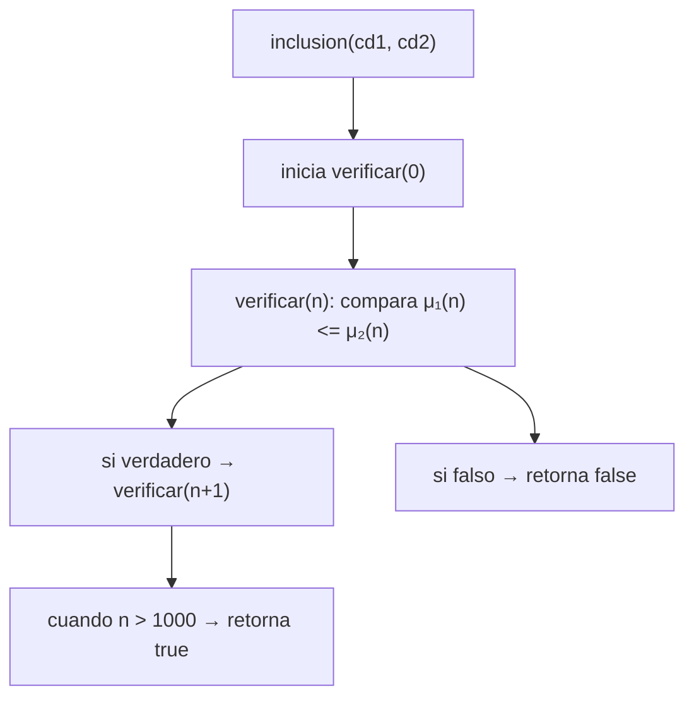
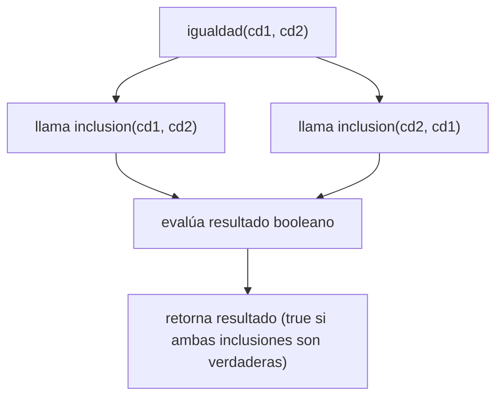

# Conjuntos Difusos-Inclusión e Igualdad

## 1. Contextualización

En los **conjuntos difusos**, la pertenencia de un elemento a un conjunto se expresa mediante un valor entre 0 y 1, que indica su grado de pertenencia.  
A diferencia de los conjuntos clásicos, donde un elemento o pertenece o no pertenece, en los conjuntos difusos esta pertenencia es gradual.

De acuerdo con la teoría propuesta por *Lotfi Zadeh (1965)*:

- La **inclusión difusa** se define como:
  $$
  S_1 \subseteq S_2 \iff \forall x \in U, \; \mu_{S_1}(x) \leq \mu_{S_2}(x)
  $$

- La **igualdad difusa** se basa en la inclusión mutua:
  $$
  S_1 = S_2 \iff (S_1 \subseteq S_2) \land (S_2 \subseteq S_1)
  $$

En este punto del taller, se implementan ambas funciones respetando la **recursión de cola** y los principios de la **programación funcional pura**.

---

## 2. Explicación de las partes del código

```scala
def inclusion(cd1: ConjDifuso, cd2: ConjDifuso): Boolean = {
  val LIMITE_UNIVERSO = 1000

  @annotation.tailrec
  def verificar(n: Int): Boolean = {
    if (n > LIMITE_UNIVERSO) {
      true
    } else {
      val pertenencia1 = cd1.getOrElse(n, 0.0)
      val pertenencia2 = cd2.getOrElse(n, 0.0)
      if (pertenencia1 <= pertenencia2)
        verificar(n + 1)
      else
        false
    }
  }

  verificar(0)
}
```

### 🔹 Descripción
La función `inclusion` verifica si el conjunto difuso `cd1` está incluido en `cd2`.  
Usa una función recursiva `verificar` que itera sobre el universo de elementos
$$ [0, 1000] $$
, comparando los grados de pertenencia
$$ \mu_{S_1}(x) $$ y $$ \mu_{S_2}(x) $$.

- Si en algún punto
  $$
  mu_{S_1}(x) > \mu_{S_2}(x)
  $$
  , se retorna `false`.

- Si se recorren todos los elementos sin fallar, la inclusión es `true`.

---

```scala
def igualdad(cd1: ConjDifuso, cd2: ConjDifuso): Boolean = {
  inclusion(cd1, cd2) && inclusion(cd2, cd1)
}
```

### 🔹 Descripción
La función `igualdad` aplica la definición teórica de igualdad difusa.  
Dos conjuntos son iguales si cada uno está incluido en el otro.  
Esto se evalúa mediante dos llamadas a `inclusion` y un operador lógico `&&`.

---

## 3. Estado de la pila y operaciones

A continuación se muestra el comportamiento de las funciones mediante notación matemática y diagramas *Mermaid*.

### 🧮 Inclusión

$$
\text{Si } \forall x \in [0, 1000], \; \mu_{S_1}(x) \leq \mu_{S_2}(x), \text{ entonces } S_1 \subseteq S_2
$$



---

### 🧮 Igualdad

$$
S_1 = S_2 \iff (S_1 \subseteq S_2) \land (S_2 \subseteq S_1)
$$



---

## 4. Argumentación de corrección

### 🔹 Inclusión

**Definición matemática:**
$$
\forall x \in U, \; \mu_{S_1}(x) \leq \mu_{S_2}(x)
$$

**Demostración de corrección:**
- La función `verificar` evalúa esta condición para cada \( x \in [0,1000] \).
- Si alguna comparación falla, la recursión termina con `false`.
- En caso contrario, llega al caso base `n > 1000` devolviendo `true`.

Por tanto:
$$
text{inclusion(cd1, cd2)} \equiv (\forall x \in [0,1000], \mu_{S_1}(x) \leq \mu_{S_2}(x))
$$

✅ **Conclusión:** la implementación cumple la definición teórica de inclusión difusa.

---

### 🔹 Igualdad

**Definición matemática:**
$$
S_1 = S_2 \iff (S_1 \subseteq S_2) \land (S_2 \subseteq S_1)
$$

**Demostración de corrección:**
- La función `igualdad` aplica dos veces `inclusion` con los conjuntos invertidos.
- El resultado `true` solo ocurre si ambas inclusiones son verdaderas.

Por tanto:
$$
\text{igualdad(cd1, cd2)} \equiv (\text{inclusion(cd1, cd2)} \land \text{inclusion(cd2, cd1)})
$$

✅ **Conclusión:** la función implementa correctamente la igualdad difusa, basándose en la inclusión mutua.

---

### ✅ Conclusión general

Las funciones cumplen los principios de la **programación funcional pura** y respetan las definiciones formales de los operadores difusos.  
Además, utilizan **recursión de cola** y **evaluación booleana eficiente**, garantizando corrección matemática y eficiencia computacional.